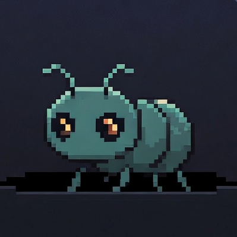

<div align="center">
  
  <h1>Flick</h1>
  <p>A macOS notch companion with an AI pet for <a href="https://docs.anthropic.com/en/docs/claude-code">Claude Code</a> developers.</p>
</div>

---

## What is Flick?

Flick lives in your MacBook notch. It monitors your Claude Code sessions, shows live status, handles tool approvals, and gives you a pet companion that reacts to your coding in real time.

It also replaces your system volume/brightness HUD, shows your calendar, plays music, and acts as a file shelf — all from the notch.

## Features

### Claude Code Integration

- **Live session monitoring** — Track multiple concurrent Claude Code sessions
- **Permission approvals** — Approve or deny tool executions directly from the notch
- **Chat interface** — View conversation history with markdown rendering
- **Usage tracking** — Session and weekly API utilization at a glance
- **Multiplexer support** — Works with cmux and tmux sessions
- **Auto-setup** — Hooks install automatically on first launch

### Pet Buddy System

- **18 species** — duck, goose, blob, cat, dragon, octopus, owl, penguin, turtle, snail, ghost, axolotl, capybara, cactus, robot, rabbit, mushroom, chonk
- **Unique identity** — Deterministically generated from your system (species, eyes, hat, rarity)
- **Live reactions** — Buddy animates based on Claude's state (idle, working, waiting, error)
- **Petting** — Tap your buddy for happy animations, rapid-tap for excited reactions
- **Stats card** — XP, level, affection meter, lifetime stats (pets, tools approved, sessions)
- **Buddy chat** — Talk to your pet via Anthropic, OpenAI, Grok, or any local LLM (Ollama, LM Studio)
- **Species personalities** — Each species has a distinct personality when chatting

### Notch Utility

- **Music player** — Album art, playback controls, audio visualizer
- **Calendar** — Upcoming events at a glance
- **Battery** — Status and charging indicator
- **HUD replacement** — Custom volume and brightness overlays
- **File shelf** — Drag-and-drop file staging area
- **Webcam preview** — Quick mirror from the notch
- **Keyboard shortcuts** — Customizable hotkeys

### Security Hardening (vs upstream)

- SHA-256 hook script integrity verification
- Unix socket authentication via `getpeereid()`
- Socket moved from `/tmp` to user-scoped Application Support
- Hook timeout reduced from 24h to 5min
- ATS narrowed to localhost-only
- All logging uses `os.Logger` with privacy annotations

## Requirements

- macOS 15.0+ (Sequoia)
- MacBook with notch (or external display support)
- [Claude Code](https://docs.anthropic.com/en/docs/claude-code) installed

## Install

### From Source

```bash
git clone https://github.com/JOSH1059/Buddi.git
cd Buddi
open buddi.xcodeproj
```

Build and run in Xcode. SPM dependencies resolve automatically. Set your signing team in Signing & Capabilities for both the `buddi` and `BuddiXPCHelper` targets.

## How It Works

```
Claude Code → Hooks → Unix Socket → Flick → Notch UI
```

Flick registers hooks with Claude Code on launch. When Claude emits events — tool use, thinking, session start/end, permission requests — the hooks forward them over a Unix domain socket. The app maps events to buddy animations and UI state. When Claude needs permission, the notch expands with approve/deny buttons.

## Buddy Chat Setup

To chat with your pet buddy, add an API key in **Settings > Claude Code > Buddy Chat**:

| Provider | Default Model | Notes |
|----------|--------------|-------|
| Anthropic | claude-sonnet-4-6 | Uses `x-api-key` header |
| OpenAI | gpt-4o-mini | Standard Bearer auth |
| Grok (xAI) | grok-3-mini-fast | OpenAI-compatible |
| Local | default | localhost:1234, works with Ollama/LM Studio |

## Lineage & Acknowledgements

Flick is a fork of [Buddi](https://github.com/talkvalue/Buddi) by TalkValue, which was built on:

- **[boring.notch](https://github.com/TheBoredTeam/boring.notch)** by TheBoredTeam — The notch UI framework. Music player, calendar, battery, HUD, file shelf, and core notch rendering.
- **[Claude Island](https://github.com/farouqaldori/claude-island)** by farouqaldori — Claude Code session monitoring, hook system, buddy characters, and chat interface.

Flick adds: security hardening (9 vulnerabilities patched), buddy petting/stats/chat system, multi-provider LLM chat, reactive session status updates, and upstream decoupling.

See [NOTICE](NOTICE) for full attribution and licensing details.

## License

This project is licensed under the [GNU General Public License v3.0](LICENSE).
